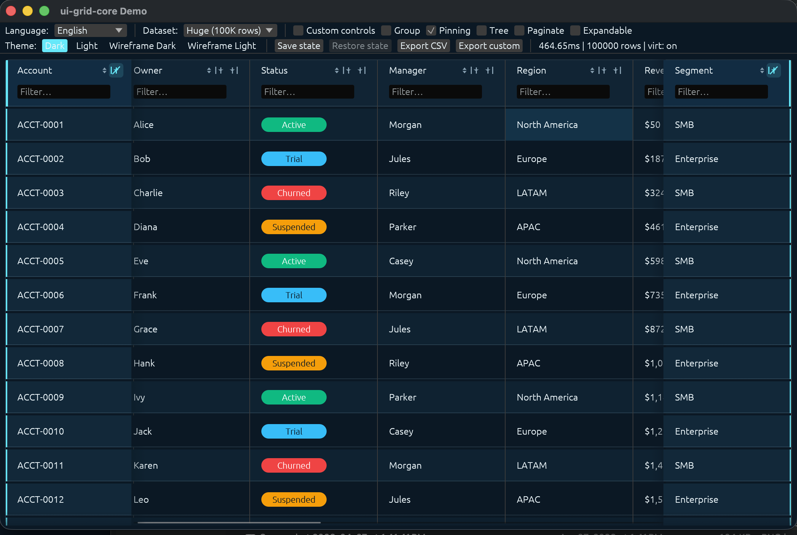

# Rust / egui

`ui-grid-egui` is the native Rust adapter for UI Grid on top of `egui`.

It wraps the core grid model with an `egui` widget layer so Rust applications can render the grid natively without a browser or JavaScript runtime.



## Install

Add the published crates to your Rust application:

```toml
[dependencies]
ui-grid-egui = "0.1"
ui-grid-core = "0.1"
```

## Minimal Usage

```rust
use ui_grid_egui::{EguiColumnExt, EguiGrid, GridThemePreset};
use ui_grid_core::models::{GridColumnDef, GridColumnType, GridOptions};

let mut grid = EguiGrid::new();
let theme = GridThemePreset::DefaultDark.build();
let mut options = GridOptions {
    id: "accounts-egui".into(),
    title: Some("Accounts".into()),
    enable_sorting: true,
    enable_filtering: true,
    enable_virtualization: true,
    ..GridOptions::default()
};

let columns = vec![
    GridColumnDef {
        name: "account_id".into(),
        display_name: Some("Account".into()),
        r#type: GridColumnType::String,
        ..GridColumnDef::default()
    },
    GridColumnDef {
        name: "revenue".into(),
        display_name: Some("Revenue".into()),
        r#type: GridColumnType::Number,
        align: Some("end".into()),
        ..GridColumnDef::default()
    },
];

let mut column_ext: Vec<EguiColumnExt> = vec![];

// Inside your egui frame:
grid.show(ui, &mut options, &columns, &mut column_ext, &theme);
```

The main exported surface is:

- `EguiGrid` — the widget entry point
- `EguiColumnExt` — per-column native egui extensions for rendering and editing
- `GridTheme` / `GridThemePreset` — theme configuration for the native widget
- `EguiGridEvent` / `EguiGridEventKind` — native event model for egui hosts

## What The egui Adapter Supports

- sorting, filtering, grouping, and pagination
- column pinning (left/right) with synchronized vertical scrolling across pinned regions
- drag-and-drop column reordering
- CSV export (default and custom formatters)
- save/restore state (serialize to JSON, restore from JSON or structured state)
- cell editing and focus management
- tree view and expandable rows
- large dataset virtualization (100K+ rows)
- theme presets and custom column extensions

## Sorting, Filtering, Grouping

Feature flags live on `GridOptions`. Set them declaratively:

```rust
use ui_grid_core::models::GridGroupingOptions;

let mut options = GridOptions {
    enable_sorting: true,
    enable_filtering: true,
    enable_grouping: true,
    enable_tree_view: true,
    enable_expandable: true,
    enable_virtualization: true,
    grouping: Some(GridGroupingOptions {
        group_by: vec!["status".into()],
    }),
    tree_children_field: Some("children".into()),
    ..GridOptions::default()
};
```

## Column Pinning

Pin columns left or right. Pinned regions scroll vertically in sync with the center region:

```rust
use ui_grid_core::pinning::PinDirection;

let mut options = GridOptions {
    enable_pinning: true,
    ..GridOptions::default()
};

let columns = vec![
    GridColumnDef {
        name: "account_id".into(),
        pinned_left: true,
        ..GridColumnDef::default()
    },
    GridColumnDef {
        name: "status".into(),
        ..GridColumnDef::default()
    },
];

// Pin programmatically at runtime:
grid.pin_column("status", PinDirection::Right);
```

## Save & Restore State

```rust
// Serialize to JSON string
let json = grid.serialize_state()?;

// Restore from JSON
grid.deserialize_state(&json)?;

// Or use the structured API
let saved = grid.save_state();
grid.restore_state(&saved);
```

## CSV Export

```rust
let payload = grid.export_csv(&options, &columns);
println!("{}", payload.content);

// Custom export formatter
let visible_count = grid.export_with(&options, &columns, |context| {
    context.visible_rows.len()
});
```

## Column Extensions

`EguiColumnExt` is the main customization hook for native Rust apps.

Use it to add:

- formatters for display values
- custom cell renderers
- custom edit widgets

```rust
let ext = vec![
    EguiColumnExt::new("revenue")
        .with_formatter(|value, _row| format!("${}", value)),

    EguiColumnExt::new("status")
        .with_cell_renderer(|ui, ctx| {
            ui.label(ctx.value.as_str().unwrap_or(""));
        }),

    EguiColumnExt::new("date")
        .with_cell_editor(|ui, value, _theme| {
            let response = ui.text_edit_singleline(value);
            response.changed()
        }),
];
```

## Run The Native Demo

From the monorepo root:

```bash
cargo run -p ui-grid-egui --example demo --release
```

That demo showcases:

- sorting, filtering, and grouping
- column pinning (left/right) with synchronized scrolling
- drag-and-drop column reordering
- CSV export (default and custom formatters)
- save/restore state (JSON serialization)
- custom renderers and editors
- tree view and expandable behavior
- theme switching with built-in presets
- large dataset scrolling and virtualization (100K+ rows)

## When To Use Which Rust Path

- Use [Rust / WASM](./rust.md) if you want the Rust engine running in a browser host.
- Use `ui-grid-egui` if you want a native Rust desktop or egui application surface.

Today these are complementary paths:

- Rust/WASM is the browser-native engine delivery path
- `ui-grid-egui` is the native Rust widget adapter

## See Also

- [crates/ui-grid-egui/README.md](../crates/ui-grid-egui/README.md)
- [Rust / WASM](./rust.md)
- [Getting Started](./getting-started.md)
